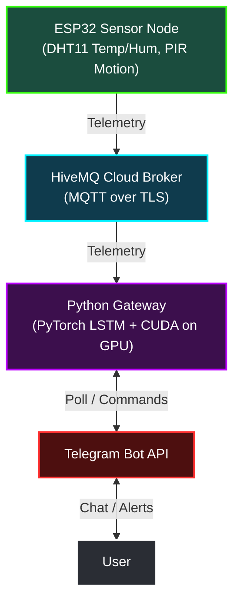

# SmartSense 🏠

SmartSense is an IoT environmental monitoring and comfort forecasting system. It uses an ESP32 edge microcontroller to read sensor data, publishes updates to HiveMQ Cloud via MQTT, and routes telemetry to a GPU-accelerated Python gateway. 

The gateway utilizes a **PyTorch LSTM model** running on CUDA to predict upcoming temperature, humidity, and comfort trends, while serving a Telegram Bot interface for user interaction.

---

## System Architecture



---

## Features

- **Edge Sensing**: ESP32 gathers room temperature, humidity, and occupancy.
- **OLED & Alarms**: Real-time display updates and local LED temperature alerts.
- **LSTM Forecasting**: A neural network running on your local NVIDIA GPU dynamically predicts future room conditions.
- **Comfort Assessment**: Auto-calculates room comfort scores on a scale of `0.0` to `10.0`.
- **Telegram Commands**:
  - `/status` — View current room temperature, humidity, occupancy, and comfort score.
  - `/predict` — Query the PyTorch model for forecasted trends.
  - `/comfort` — Overview of comfort ratings.

---

## Directory Layout

```
smartsense/
├── smartsense.ino       # ESP32 main firmware
├── secrets.h            # C++ credentials (git-ignored)
├── secrets.h.example    # C++ credentials template
├── LICENSE              # MIT License
├── README.md            # Project documentation
└── gateway/             # Python Gateway component
    ├── .env             # Python credentials (git-ignored)
    ├── .env.example     # Python credentials template
    ├── requirements.txt # Python requirements
    ├── model.py         # PyTorch CUDA models
    └── main.py          # MQTT listener and Telegram Bot service
```

---

## Setup & Run

### 1. ESP32 Setup
1. Copy `secrets.h.example` to `secrets.h`:
   ```bash
   cp secrets.h.example secrets.h
   ```
2. Update the credentials inside `secrets.h` with your Wi-Fi SSID, password, and HiveMQ MQTT broker configuration.
3. Flash `smartsense.ino` to your ESP32 board using Arduino IDE or PlatformIO.

### 2. Python Gateway Setup
1. Copy `gateway/.env.example` to `gateway/.env`:
   ```bash
   cp gateway/.env.example gateway/.env
   ```
2. Open `gateway/.env` and fill in your HiveMQ credentials and `TELEGRAM_BOT_TOKEN`.
3. Install the gateway dependencies:
   ```bash
   pip install -r gateway/requirements.txt
   ```
   *(Note: Ensure you have PyTorch installed with CUDA support to utilize your local GPU).*
4. Start the gateway daemon:
   ```bash
   python gateway/main.py
   ```

---

## License

This project is licensed under the [MIT License](LICENSE).
